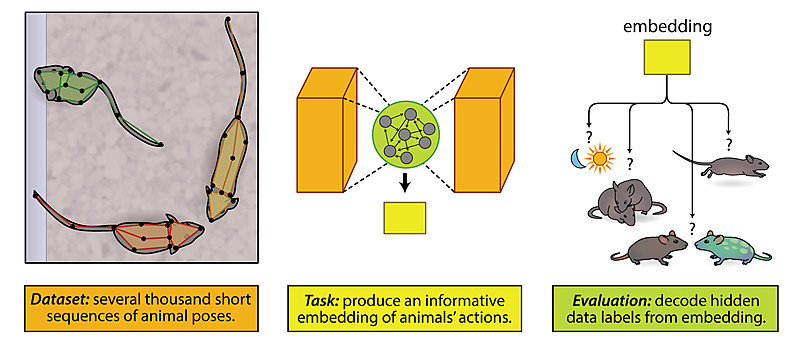

# MABe-AntBeetleGroupsVideo

MABe - Ant &amp; Beetle Groups Video Data; Behavioral Representation Learning from 🐜 &amp; 🪲 using video dataset.

The solution leads to 2nd position at CVPR 2022 competition track - Multi Agent Behavior challenge Task (Ant & Beeetle Groups Video Data)

| Average Rank    | Mean F1 Score | Mean MSE   | F1 (Task 1) | F1 (Task 3) | F1 (Task 5) | F1 (Task 7) |
| :-------------- | ------------- | ---------- | ----------- | ----------- | ----------- | ----------- |
| **4.230** | **0.581**    | **0.018** | **0.785**  | **1.000**  | **0.823**  | **0.635**  |

DId an unsupervised model training using contrastive learning with modified SimCLR.

SimCLR - https://arxiv.org/abs/2002.05709

# [SimCLR - A Simple Framework for Contrastive Learning of Visual Representations](https://github.com/google-research/simclr#simclr---a-simple-framework-for-contrastive-learning-of-visual-representations)

